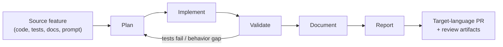

# Strandslator Design

**Status**: Proposed

**Date**: 2026-06-12

**Issue**: https://github.com/strands-agents/harness-sdk/issues/2666

## Overview

Every feature we build in one language eventually needs to exist in all the others. If Strands supports N languages with M features, keeping them in sync becomes an N * M cost.

Strandslator is a proposed system that uses agents to handle feature translation across languages. The bottleneck we're targeting isn't necessarily the translation itself, it's the review. An agent can produce the code, but a human still needs to verify its correctness, security, and idiomaticity. That verification is what takes time, and it's what we want to make fast. The system's design centers on giving reviewers the evidence and artifacts they need to approve a translation PR with both confidence and speed.

This document describes the translation workflow, the input context, the agents involved, and the artifacts they generate. Orchestration will be discussed separately, but likely we build upon the existing GitHub agent infrastructure we already have in place ([ideas](https://gist.github.com/agent-of-mkmeral/5a4d0ce16a1242a711d77d7e01c19902#6-adversarial--cross-language-differential-testing)).

## Solution

Strandslator takes one completed source feature and one target language as input. The developer who completes the feature is the one who kicks off the workflow. Triggering is manual to start, since having a human make the call ensures the feature is genuinely ready before translation begins. We can explore automating this over time, but for now the human judgment is worth it.

We scope each run to a single target language so we can inject language-specific context into the agents and keep the run focused enough to produce a reviewable PR. The workflow runs a sequence of agents that plan, implement, and validate the translation, restarting from the top if validation finds issues. Once everything passes, it produces documentation and assembles the review artifacts into a PR.

This workflow is only as good as the features it translates. A few principles set the preconditions and constrain how it operates:

- **No true source language.** A feature can originate in any language and translate to all others. Python however requires care, since some features touch components that follow outdated design patterns we no longer want to propagate. Features that are isolated enough from those components may translate just fine.
- **Translate only completed features.** Complete means merged, tested, and documented. Code, tests, and docs must be in sync before translation kicks off. Anytime someone updates an existing feature, they update all paired files first.
- **Explicit readiness.** Features may be developed or updated iteratively and so we don't want the workflow guessing whether work is done. We explicitly mark a feature as ready for translation once complete and all paired files are in sync.
- **Translate, don't improve.** The agent reproduces behavior as-is. It does not fix unrelated code or redesign the feature.
- **Idiomatic over literal, when confident.** Prefer a translation idiomatic to the target language. When uncertain, a literal translation is a fine starting point. The reviewer can always provide more context to guide the next iteration.
- **Idiomatic surface over a portable core.** Build features with clean object-oriented design and a core that translates well across languages. Per-language deviations should be minimal and focused on developer experience, not functionality. For example, Python's `@tool` decorator is an idiomatic surface that returns a `FunctionTool` instance under the hood, and `FunctionTool` is the portable core that exists across languages.
- **Design for portability.** When designing a feature, we should be mindful of how well it will translate. Clean, well-structured implementations translate more straightforwardly, and the agent shouldn't have to work around ambiguous or tangled code. If a feature is hard for the agent to translate, that's a signal the source needs cleanup before it's marked ready.
- **Fix the system, not the instance.** Generalize failures into rules and update the system's context. If the root cause is upstream (ambiguous source, stale metadata), fix the feature development workflow. One-off corrections don't compound; system improvements do.

## Context

All input context lives in the monorepo. No GitHub issues are needed. During a run however, the agents are free to collect additional context on their own from external sources such as the web.

Beyond the source code itself, the workflow draws on a set of markdown guides at fixed paths that describe how we build, test, secure, and document Strands. Think of this as a "strands-md" layer: a prose definition of the SDK that fills in the gaps where code alone doesn't tell the full story. Shared guidance lives in the root of the repo, and language-specific variants live in their respective packages (strands-py, strands-ts, etc.). Agents load these from known locations so they never have to guess where to look. The guides will evolve over time, and this list is by no means exhaustive, but the initial set includes:

- **Source.** The feature code with API docstrings, pairing tests, and a metadata markdown file. Tests should use docstrings to describe the behavior being asserted when it isn't obvious from the assertions alone. The metadata file sits next to the feature module or in its subdirectory and explains why the feature is designed the way it is, including what we consider subjective. The code is the true spec, so this file should stay concise. We separate it from docstrings because docstrings are about public API usage, not internal implementation rationale. When feature code is updated, pairing metadata and tests must be updated too. The translation workflow should never have to work around conflicting context; that is a problem for the feature design workflow.
- **Testing.** Cross-language rules for how we define tests. For example, we follow a one-to-one directory layout where source module `a` has a pairing test module `a`. Language-specific conventions layer on top. In Python for example, we use pytest with fixtures where shareable fixtures live in `conftest.py`.
- **Building.** Covers environment setup, how to run tests, and what checks must pass before a PR is submitted (linting, formatting, etc.). Language-specific tooling is called out where relevant. In Python for example, we use hatch for environment and task management.
- **Security.** Guidance on writing secure code and common pitfalls to avoid, such as leaking credentials, exposing sensitive data in logs, or accessing restricted paths.
- **Documentation.** General documentation standards, with language-specific variants where conventions differ.

## Artifacts

Each run produces the translated code, tests, and docs, plus a review report attached to the PR. The report is the heart of this proposal. Its job is to give the reviewer confidence that the translation is correct, safe, and idiomatic, without having to reverse-engineer that confidence from the diff alone.

Artifacts must be mechanically derived, not narrated. Since the agent writes its own report, anything it merely asserts carries no weight. What builds confidence is evidence the agent can't fake: actual test output, actual diffs, conventions the reviewer can spot-check. The report indexes and explains that evidence.

The exact schema is not yet decided and will evolve as we learn what reviewers actually need. The overriding goal is human readability. Any time a reviewer is confused about something on a PR, that signals a gap in the report to fill. This list is by no means exhaustive, but the initial set of artifacts we think are worth highlighting:

- **Behavior traceability matrix.** Maps each source test to the target test that asserts the same behavior, with its run result. Missing or unmapped rows are visible at a glance.
- **Captured test run output.** The actual target runner output, not just "tests passed."
- **Differential test results.** Where behavior can be captured as input to output, run the same vectors through both implementations and show they agree.
- **Structural map.** How the source decomposes and where each piece landed in the target. Answers "is the whole feature here?"
- **Decision log.** Where the agent deviated from the source, what it chose, why, and what alternatives it considered.
- **New dependencies and capability delta.** Any third-party dependency or system capability (network, filesystem, env vars) the target requires that the source didn't, with justification.
- **Sensitive-surface diff.** Auto-surfaces code touching credentials, network, subprocess, or deserialization.
- **Lint, format, and type-check results.** Near-free evidence of convention adherence since these must pass anyway.
- **Open questions and gaps.** Anything the agent couldn't assert or was unsure about, flagged loudly. A report that surfaces its own gaps earns the benefit of the doubt elsewhere.

## Agents

The workflow splits the translation into a handful of specialized agents that run in sequence, each given only the context relevant to its job. Narrow, role-specific context keeps each agent focused and its prompt small, which tends to improve quality. The roles below are a starting point, not a fixed contract. As we experiment, we can scale the number and granularity of agents up or down (splitting one role into several, or merging a few) based on what produces the best results.

- **Plan.** Works out how to translate the source feature into the target language. Fed the source code, docstrings, tests, and pairing metadata, plus the target language's guides (testing, building, security, documentation) and any target-specific context. Produces the implementation plan the downstream agents follow.
- **Implement.** Carries out the plan. Fed the plan, the source code, and the target building and security guides. Free to search the web for things like third-party library APIs it needs to write the code.
- **Validate.** Confirms the implementation is correct, runs the tests, and checks that the source's behaviors are asserted and met. Fed the source tests (the behavior spec), the target implementation and tests, and the testing guide. Sends the workflow back to planning when it finds gaps.
- **Document.** Updates docstrings as needed and contributes to the user docs. Fed the target implementation and the documentation guide.
- **Report.** Describes exactly what was done, assembles the review artifacts, and opens the PR. Fed the outputs of every prior agent: the plan, the diff, the test results, and the decisions made along the way.

## Determinism

We want to lean into agents first and see how far automation gets us, then add determinism over time where it earns its place. Every step we make deterministic narrows the agent's scope and trims its context, which tends to help both performance and security.

Committing and pushing code is a good example. Rather than letting the agent decide when and how, we could hard-code those steps and take the responsibility off its plate entirely.

## Experiments

I ran two experiments to validate the workflow and understand where human effort actually goes.

In the first experiment, I translated the Anthropic model provider from TypeScript to Python, erasing existing traces from the Python SDK to set realistic conditions. With Opus 4.8 and above, translation quality was strong. The takeaway: translation itself is not the bottleneck; review infrastructure is. That shifted focus toward the artifacts and report design in this proposal.

In the second experiment, I used the Strandslator prototype to port `BedrockKnowledgeBaseStore` from TypeScript to Python ([#2834](https://github.com/strands-agents/harness-sdk/pull/2834)): store implementation, config types, 54 unit tests, and integration tests against a live Bedrock Knowledge Base. The prototype ran end to end and produced working code, but required human redirection on four issues:

- **Dataclass instead of TypedDict for configs.** The codebase uses both (e.g. `CacheConfig` is a dataclass, `BaseModelConfig` is a TypedDict) for the same pattern, so the agent picked the wrong precedent. Partially corrected ([#2824](https://github.com/strands-agents/harness-sdk/pull/2824)), but inconsistencies remain. The rule: a TS `interface` passed as a constructor object literal maps to a `TypedDict`.
- **`MemoryStoreConfig` was a Protocol, not a TypedDict.** From a separate earlier port. Protocols can't be spread into constructor kwargs, so the agent couldn't compose with the shared config type.
- **No uuid7 in Python.** The TS source uses uuid v7 for document IDs; Python's stdlib has no v7 until 3.14, so the agent used uuid4. A genuine language gap, not a codebase consistency issue.
- **Skipped boto3-stubs[s3].** Adding the stub would have tightened typing repo-wide (boto3-stubs injects overloads via package install, not per-import), exposing a pre-existing error in an unrelated file. The agent surfaced the issue and correctly refused to fix code outside the feature, but that forced human intervention.

All but uuid7 trace to inconsistencies in the Python codebase. The agent was influenced by conflicting precedents and made defensible-but-wrong choices. With consistency going forward, this port reduces to a single decision (uuid7 vs uuid4). That is the concrete payoff of "Design for portability" and "Fix the system, not the instance": consistency means less human intervention, and the intervention that remains is about genuine language gaps rather than inherited drift.

## References

- **[Adversarial and cross-language differential testing](https://gist.github.com/agent-of-mkmeral/5a4d0ce16a1242a711d77d7e01c19902#6-adversarial--cross-language-differential-testing).** Design notes on building an agentic multi-language SDK (from @mkmeral), whose differential testing section argues for proving behavioral equivalence with failing tests as "non-hallucinatable evidence" rather than agent opinion.
- **[ReCodeAgent (arXiv:2604.07341)](https://arxiv.org/abs/2604.07341).** Paper on an autonomous multi-agent system that translates and validates entire code repositories across languages, reporting high translation success rates over 118 real-world projects.
