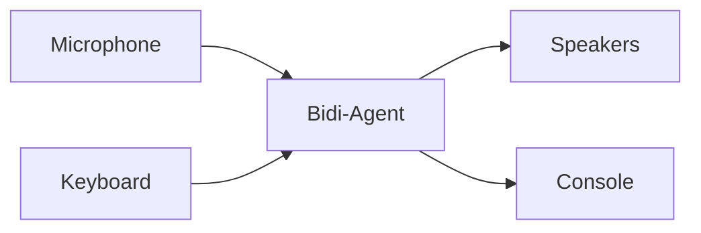

I/O channels handle the flow of data between your application and the bidi-agent. They manage input sources (microphone, keyboard, WebSocket) and output destinations (speakers, console, UI) while the agent focuses on conversation logic and model communication.



## I/O Interfaces

The bidi agent uses two protocol interfaces that define how data flows in and out of
conversations:

- `BidiInput`: A callable protocol for reading data from sources such as a microphone,
  keyboard, or WebSocket and returning `BidiAgentInput`.
- `BidiOutput`: A callable protocol for receiving `BidiOutputEvent` objects from the
  agent and handling them appropriately.

Both protocols include optional lifecycle methods (`start` and `stop`) for resource
management.

Implementation of these protocols will look as follows:

```python
from strands.experimental.bidi.agent import BidiAgent
from strands.experimental.bidi.types import BidiAgentInput
from strands.experimental.bidi.types import BidiOutputEvent
from strands.experimental.bidi.types import BidiInput, BidiOutput


class MyBidiInput(BidiInput):
    async def start(self, agent: BidiAgent) -> None:
        # Initialize input resources or state, using agent as needed.
        return

    async def __call__(self) -> BidiAgentInput:
        # Read or generate input and return a BidiAgentInput value.
        return {"text": "Hello"}

    async def stop(self) -> None:
        # Clean up any input resources or state.
        return


class MyBidiOutput(BidiOutput):
    async def start(self, agent: BidiAgent) -> None:
        # Initialize output resources or state, using agent as needed.
        return

    async def __call__(self, event: BidiOutputEvent) -> None:
        # Process the event as needed for your application.
        print(event)

    async def stop(self) -> None:
        # Clean up any output resources or state.
        return
```

## I/O Usage

To connect your I/O channels into the agent loop, you can pass them as arguments into the agent `run()` method.

```python
import asyncio

from strands.experimental.bidi.agent import BidiAgent
from strands.experimental.tools import stop


async def main():
    # stop tool allows user to verbally stop agent execution.
    agent = BidiAgent(tools=[stop])
    await agent.run(inputs=[MyBidiInput()], outputs=[MyBidiOutput()])


asyncio.run(main())
```

The `run()` method handles the startup, execution, and shutdown of both the agent and its I/O channels. Inputs and outputs run concurrently, so you can mix and match them freely.

## Audio I/O

To connect a microphone and speakers to the bidi-agent, use `BidiAudioIO`. It captures microphone audio, streams it to the model in real time, and plays responses back through the speakers using [PyAudio](https://pypi.org/project/PyAudio/).

:::note[Installation Required]
`BidiAudioIO` requires the `bidi-io` and `bidi-pyaudio` extras plus the PortAudio system library. Install PortAudio first (for example `brew install portaudio` on macOS or `sudo apt-get install portaudio19-dev` on Debian/Ubuntu), then install the extras:
```bash
pip install "strands-agents[bidi,bidi-io,bidi-pyaudio]"
```
PyAudio is excluded from the aggregate `bidi-all` extra because of its PortAudio system dependency, so install `bidi-pyaudio` explicitly even when you already have `bidi-all`.
:::

```python
import asyncio

from strands.experimental.bidi.agent import BidiAgent
from strands.experimental.bidi.io import BidiAudioIO
from strands.experimental.tools import stop


async def main():
    # stop tool allows user to verbally stop agent execution.
    agent = BidiAgent(tools=[stop])
    audio_io = BidiAudioIO(input_device_index=1)

    await agent.run(
        inputs=[audio_io.input()],
        outputs=[audio_io.output()],
    )


asyncio.run(main())
```

This creates a voice-enabled agent that captures audio from your microphone, streams
it to the model as `AudioDelta` inputs, and plays responses through your speakers.

Audio output also displays live transcripts, with user speech in shaded `>` blocks
and assistant speech as plain text. The next user prompt appears when response
generation finishes or is interrupted.

### Configurations

`BidiAudioIO` accepts the fields of `BidiAudioIOConfig` as keyword arguments:

| Parameter | Description | Example | Default |
| --------- | ----------- | ------- | ------- |
| `audio_processor` | Enable microphone audio processing. Pass `True` for defaults or a `BidiAudioProcessorConfig` for custom options. | `True` | None (disabled) |
| `input_buffer_size` | Maximum number of audio chunks to buffer from the microphone before dropping the oldest. | `1024` | None (unbounded) |
| `input_device_index` | Specific microphone device ID to use for audio input. | `1` | None (system default) |
| `input_frames_per_buffer` | Number of audio frames to read per input callback (affects latency and performance). | `1024` | 512 |
| `output_buffer_size` | Maximum number of audio chunks to buffer for speaker playback before dropping the oldest. | `2048` | None (unbounded) |
| `output_device_index` | Specific speaker device ID to use for audio output. | `2` | None (system default) |
| `output_frames_per_buffer` | Number of audio frames to write per output callback (affects latency and performance). | `1024` | 512 |

### Audio Processing

To run a voice agent over open speakers without a headset, enable microphone audio processing. It applies acoustic echo cancellation, noise suppression, and automatic gain control so the agent's own playback does not feed back into the microphone as an interruption.

Audio processing depends on `pywebrtc-audio`, installed through the `bidi-aec` extra:

```bash
pip install "strands-agents[bidi,bidi-pyaudio,bidi-aec]"
```

Pass `audio_processor=True` for the defaults, or a `BidiAudioProcessorConfig` to tune it:

```python
from strands.experimental.bidi import BidiAudioProcessorConfig
from strands.experimental.bidi.io import BidiAudioIO

# Echo cancellation, noise suppression, and auto gain control with defaults:
audio_io = BidiAudioIO(audio_processor=True)

# Noise suppression and auto gain control without echo cancellation (for headset users):
audio_io = BidiAudioIO(audio_processor=BidiAudioProcessorConfig(echo_cancellation=False))
```

`BidiAudioProcessorConfig` exposes two fields:

| Parameter | Description | Default |
| --------- | ----------- | ------- |
| `echo_cancellation` | Cancel the agent's speaker audio from the microphone input. | `True` |
| `stream_delay_ms` | Playback-to-capture delay hint in milliseconds for echo cancellation. `0` lets the canceller auto-estimate. Set a non-zero value only when echo cancellation measurably fails on hardware with large or fixed latency, such as Bluetooth. | `0` |

Echo cancellation coordinates the microphone and speaker channels, so it works only when both come from the same `BidiAudioIO` instance. It also requires a microphone sample rate of 16000, 32000, or 48000 Hz, set through the model's audio config.

Configure voice and supported sample rates on the model. `BidiAudioIO` reads
`model.get_audio_config()`, which returns separate `input` and `output` dictionaries,
each containing `sample_rate`, `channels`, and `format`. It uses those values to
configure capture and playback, so you do not need to repeat them on the I/O channel.

`BidiAudioIO` requires signed 16-bit little-endian PCM. Starting a device stream with
another encoding raises `ValueError`. Use custom I/O for other encodings.

### Interruption Handling

`BidiAudioIO` handles interruptions automatically so users can cut in mid-response. When an interruption occurs:

1. The agent emits a `BidiInterruptionEvent`.
2. `BidiAudioIO` clears its output buffer to stop playback.
3. The agent responds to the new user input.

## Text I/O

For terminal-based text input and output, use `BidiTextIO`. It reads user input from the terminal and prints transcripts and responses to the console using [prompt-toolkit](https://pypi.org/project/prompt-toolkit/).

:::note[Installation Required]
`BidiTextIO` is included with the `bidi-io` extra:
```bash
pip install "strands-agents[bidi-io]"
```
:::

```python
import asyncio

from strands.experimental.bidi.agent import BidiAgent
from strands.experimental.bidi.io import BidiTextIO
from strands.experimental.tools import stop


async def main():
    # stop tool allows user to verbally stop agent execution.
    agent = BidiAgent(tools=[stop])
    text_io = BidiTextIO(input_prompt="> You: ")

    await agent.run(
        inputs=[text_io.input()],
        outputs=[text_io.output()],
    )


asyncio.run(main())
```

This creates a text-based agent that reads user input from the terminal and prints
transcripts and responses to the console.

### Configurations

| Parameter | Description | Example | Default |
| --------- | ----------- | ------- | ------- |
| `input_prompt` | Prompt text displayed when waiting for user input | `"> You: "` | `""` (blank) |

## WebSocket I/O

WebSockets are a common I/O channel for bidi-agents. To learn how to setup WebSockets with `run()`, consider the following server example:

```python
# server.py
from fastapi import FastAPI, WebSocket, WebSocketDisconnect

from strands.experimental.bidi.agent import BidiAgent
from strands.experimental.bidi.models import OpenAIRealtimeModel

app = FastAPI()


@app.websocket("/text-chat")
async def text_chat(websocket: WebSocket) -> None:
    model = OpenAIRealtimeModel(api_key="<OPENAI_API_KEY>")
    agent = BidiAgent(model=model)

    try:
        await websocket.accept()
        await agent.run(inputs=[websocket.receive_json], outputs=[websocket.send_json])
    except* WebSocketDisconnect:
        print("client disconnected")
```

Start this server with `uvicorn server:app --reload`. To interact, open a separate terminal and run the following client script:

```python
# client.py
import asyncio
import json

import websockets


async def main():
    websocket = await websockets.connect("ws://localhost:8000/text-chat")

    input_content = {"text": "Hello, how are you?"}
    await websocket.send(json.dumps(input_content))

    while True:
        output_event = json.loads(await websocket.recv())
        if output_event["type"] == "bidi_transcript_complete":
            print(output_event["transcript"])
            break

    await websocket.close()


if __name__ == "__main__":
    asyncio.run(main())
```
